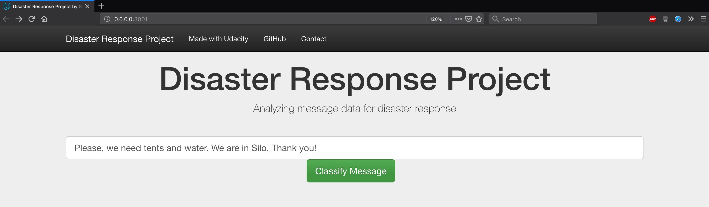
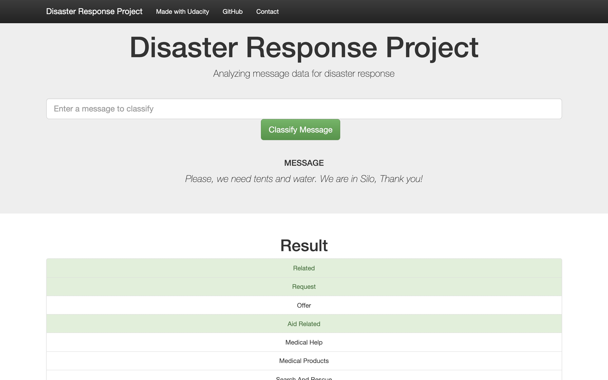
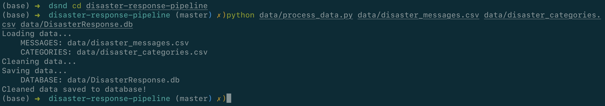
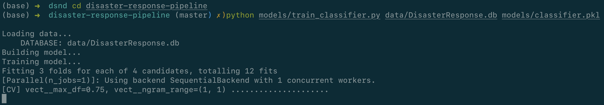
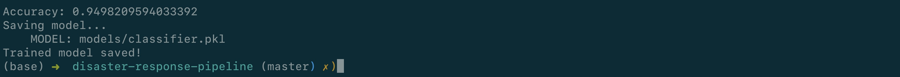
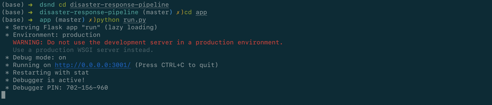
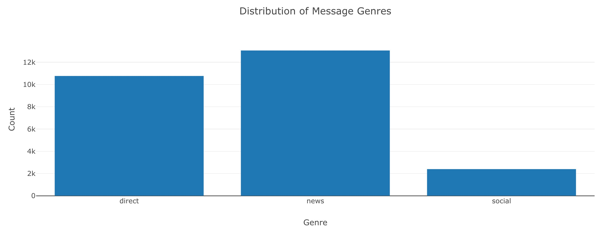
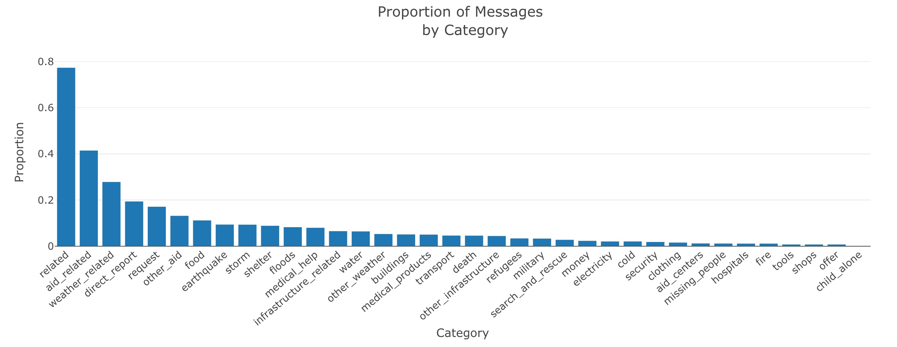

# Disaster Response Pipeline Project


## 1. Project Motivation

In this project, I'll apply data engineering to analyze disaster data from Figure Eight to build a model for an API that classifies disaster messages.

_data_ directory contains a data set which are real messages that were sent during disaster events. I will be creating a machine learning pipeline to categorize these events so that appropriate disaster relief agency can be reached out for help.

This project will include a web app where an emergency worker can input a new message and get classification results in several categories. The web app will also display visualizations of the data.

My project <a href="https://github.com/ebulutbaltaci/Disaster_Response_Pipeline" target="_blank">GitHub</a> repository.


### 1.1. Instructions

1. Run the following commands in the project's root directory to set up your database and model.

    - To run ETL pipeline that cleans data and stores in database
        `python data/process_data.py data/disaster_messages.csv data/disaster_categories.csv data/DisasterResponse.db`
    - To run ML pipeline that trains classifier and saves
        `python models/train_classifier.py data/DisasterResponse.db models/classifier.pkl`

2. Run the following command in the app's directory to run your web app.
    `python run.py`

3. Go to http://0.0.0.0:3001/


## 2. Project Components

There are three components of this project:


### 2.1. ETL Pipeline

File _data/process_data.py_ contains data cleaning pipeline that:

- Loads the `messages` and `categories` dataset
- Merges the two datasets
- Cleans the data
- Stores it in a **SQLite database**


### 2.2. ML Pipeline

File _models/train_classifier.py_ contains machine learning pipeline that:

- Loads data from the **SQLite database**
- Splits the data into training and testing sets
- Builds a text processing and machine learning pipeline
- Trains and tunes a model using GridSearchCV
- Outputs result on the test set
- Exports the final model as a pickle file


### 2.3. Flask Web App


Running this command **from app directory** will start the web app where users can enter their query, i.e., a request message sent during a natural disaster, e.g. _"Please, we need tents and water. We are in Silo, Thank you!"_.




What the app will do is that it will classify the text message into categories so that appropriate relief agency can be reached out for help.





## 3. Running

There are three steps to get up and runnning with the web app if you want to start from ETL process.


### 3.1. Data Cleaning

**Go to the project directory** and the run the following command:

```bat
python data/process_data.py data/disaster_messages.csv data/disaster_categories.csv data/DisasterResponse.db
```

The first two arguments are input data and the third argument is the SQLite Database in which we want to save the cleaned data. The ETL pipeline is in _process_data.py_.

_DisasterResponse.db_ already exists in _data_ folder but the above command will still run and replace the file with same information. 





### 3.2. Training Classifier

After the data cleaning process, run this command **from the project directory**:

```bat
python models/train_classifier.py data/DisasterResponse.db models/classifier.pkl
```

This will use cleaned data to train the model, improve the model with grid search and saved the model to a pickle file (_classifer.pkl_).

_classifier.pkl_ already exists but the above command will still run and replace the file will same information.




It took me around **4 minutes** to train the classifier with grid search.

When the models is saved, it will look something like this.





### 3.3. Starting the web app

Now that we have cleaned the data and trained our model. Now it's time to see the prediction in a user friendly way.

**Go the app directory** and run the following command:


```bat
python run.py
```

This will start the web app and will direct you to a URL where you can enter messages and get classification results for it.





## 4. Conclusion

Some information about training data set as seen on the main page of the web app.







As we can see the data is highly imbalanced. Though the accuracy metric is high (you will see the exact value after the model is trained by grid search, it is ~0.94), it has a poor value for recall (~0.6). So, take appropriate measures when using this model for decision-making process at a larger scale or in a production environment.


## 5. Results

1. An ETL pipleline was built to read data from two csv files, clean data, and save data into a SQLite database.
2. A machine learning pipepline was developed to train a classifier to performs multi-output classification on the 36 categories in the dataset.
3. A Flask app was created to show data visualization and classify the message that user enters on the web page.


## 6. Files

<pre>
.
├── app
│   ├── run.py------------------------# FLASK FILE THAT RUNS APP
│   └── templates
│       ├── go.html-------------------# CLASSIFICATION RESULT PAGE OF WEB APP
│       └── master.html---------------# MAIN PAGE OF WEB APP
├── data
│   ├── DisasterResponse.db-----------# DATABASE TO SAVE CLEANED DATA TO
│   ├── disaster_categories.csv-------# DATA TO PROCESS
│   ├── disaster_messages.csv---------# DATA TO PROCESS
│   └── process_data.py---------------# PERFORMS ETL PROCESS
├── images---------------------------# PLOTS FOR USE IN README AND THE WEB APP
├── models
│   └── train_classifier.py-----------# PERFORMS CLASSIFICATION TASK

</pre>


## 7. Software Requirements

This project uses **Python 3**.

## 8. Libraries Used

I use Python3. Here are the libraries I used in my Jupyter Notebook:

1. sys
2. nltk
3. numpy
4. nltk.tokenize
5. nltk.stem
6. pandas
7. sqlalchemy
8. re
9. sklearn.pipeline
10. sklearn.ensemble
11. sklearn.multioutput
12. sklearn.model_selection
13. sklearn.feature_extraction.text
14. sklearn.metrics
15. sklearn.tree
16. pickle
17. json
18. joblib
19. plotly
20. flask
21. plotly.graph_objs


## 9. Licensing, Authors, Acknowledgements

This project is apart of Udacity's Data Science Nanodegree Program, which provides initial starter code for the project. Additionally, the original datasets are provided in part by FigureEight.
